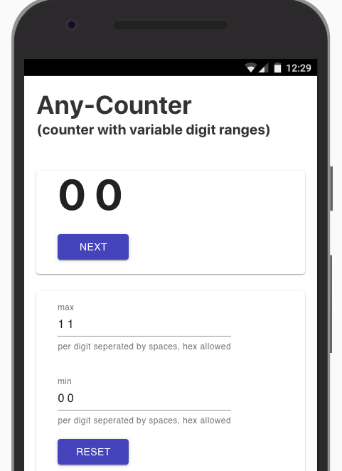
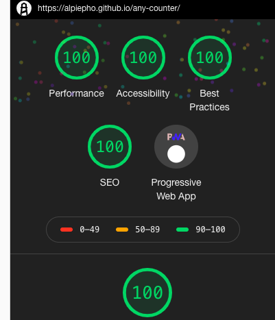

## Simple Score Volleyball PWA

:construction: WORK IN PROGRESS 

This was copied from [any-counter](https://github.com/alpiepho/any-counter) and is still
a work-in-progress.

This will be a PWA application that allows easy score keeping of a volleyball match
with an additional button to send text messages of the ongoing match results to a 
preconfigured list of phone numbers.

The PWA version will be written with React/Gatsby on the front end, hosted on Netlify,
and use a Netlify Function (basically an AWS Lamda function) to interface with Twillio
to send texts.

Eventually, this will be ported to an Expo application so it can run natively on IOS
and Android.

----------------------------------------------------

## Any Counter PWA

### What it is
This is a simple PWA (Progressive Web Application) written in React.js and the Server Side Rendering framework Gatsby.js. This was designed using the Google Material UI React package.

This is hosted on GH-Pages [here](https://alpiepho.github.io/any-counter/)

### So, Why?

What is the purpose of this application?

There are several problems that can be solved with a counter that uses different ranges for the digits. For example, if you enter all 1s for max, then you have a binary counter. If you enter 'FF', then you have a hex counter.

A more complex example is min set to '5 0 0' and max set to '9 59 59' then you have a time counter from 5 mins to 10 mins.

This algorithm was originally used to 'count' thru the permutations of letter from a phone. '2' shows 'abc', '7' shows 'pqrs'. The ranges are different. This algorithm was used to map from integers to letters. With min set to '0 0', and max to '2 3', the count would be '0 0', '0 1'...'2 3'. This can easily be mapped to 'ap', 'aq'...'cs'.

## Success!!!

I have been exeprimenting with LightHouse testing for a few weeks.  I noticed the Look/Feel of this tool changed with a recent update of Chrome.  I also saw a cool easter egg when I hit all 100s for this app (sorry, can't show the animated fireworks):

##  Whats left TODO

This is a list of some things to finish up:

- Clean up layout.js (remove or use Header etc)
- Clean up unused components
- Create Bootstrap version
- Use this for other apps:
    - A clock timer
    - A date count down

